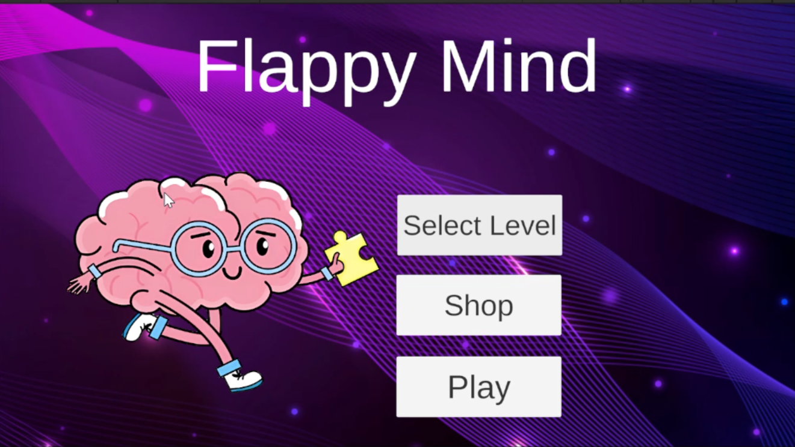
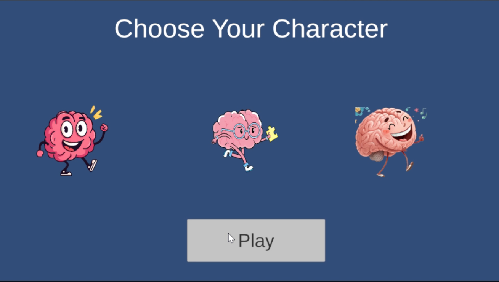
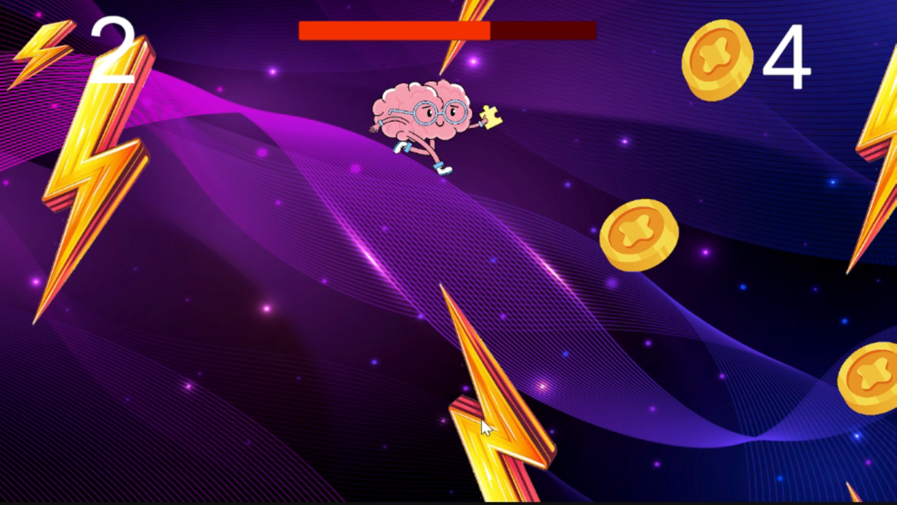
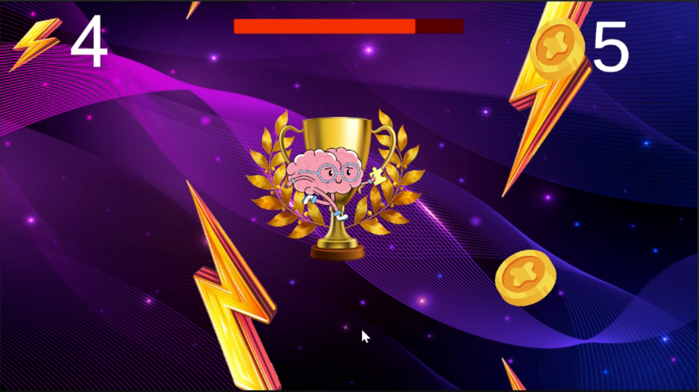
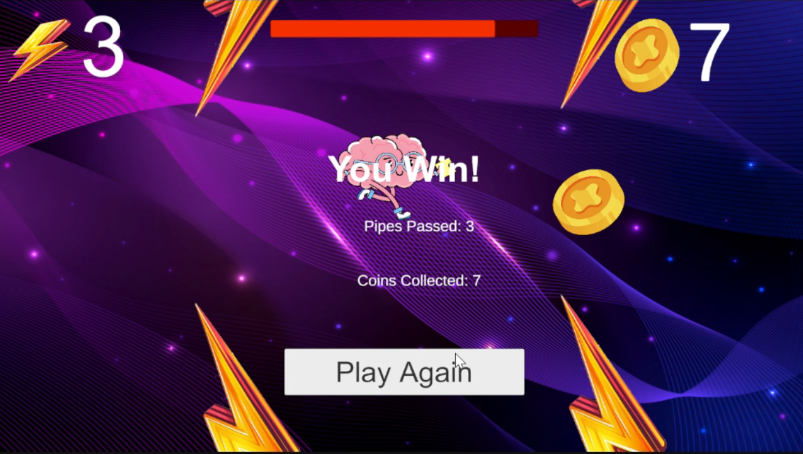
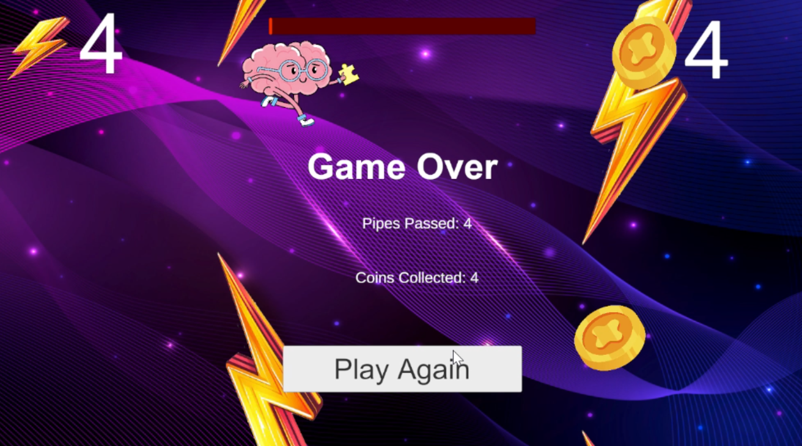

# Flappy Mind Unity Game

Flappy Mind is a 2D Unity game inspired by the classic Flappy Bird game, with additional gameplay features and enhanced user interaction.

## Overview

The game challenges the player to control a character, avoid obstacles, collect coins, manage power, and survive until reaching the winning condition. The project was developed as part of a Unity game development assignment and expanded with extra features to make the gameplay more engaging.

## Features

* Easy and Hard difficulty levels
* Coin collection system
* Power bar system
* Shield reward system
* Character selection shop
* Win and lose conditions
* Background music and sound effects
* Final score display

## Gameplay

The player controls the character by making it fly through obstacles. The goal is to pass pipes, collect coins, and keep the power level above zero. The player wins after successfully passing the required number of pipes.

## Screenshots

### Main Menu

### Character Selection

### Gameplay

### Power Bar and Shield System

### Win Screen

### Game Over Screen

## Technologies Used

- Unity 2D
- C#
- Visual Studio
- Unity UI System
- Audio Management

## Project Structure

* `Assets/` contains game scripts, sprites, scenes, audio, and prefabs.
* `Packages/` contains Unity package dependencies.
* `ProjectSettings/` contains Unity project configuration files.

## How to Run

1. Clone or download the repository.
2. Open the project using Unity.
3. Open the main scene from the `Assets` folder.
4. Press Play to start the game.

## Challenges and Solutions

- Implemented a Power Bar system that decreases after collisions.
- Added a Shield reward system activated after collecting coins.
- Developed Easy and Hard difficulty modes with different gameplay settings.
- Designed a character selection shop and dynamic game flow.

## Gameplay Demo

🎥 Watch the gameplay video:
https://youtu.be/j6x5Jaq50lM

## Developer

Developed by Waeed Alrefaai.
